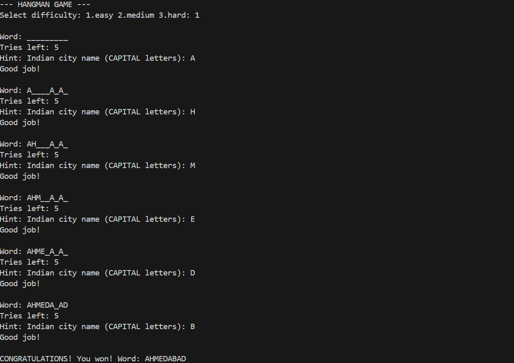

# Hangman_game
In the realm of computer programming, developing logic-building games is a fundamental way to enhance problem-solving skills and algorithmic thinking. Hangman is a classic word-guessing game that challenges players to identify hidden words within a limited number of attempts, making it an engaging tool for testing vocabulary and deduction skills. This project focuses on the design and implementation of a text-based Hangman Game using the C programming language.
The game is designed to allow users to guess a hidden word character by character while the system tracks the correct guesses and the number of remaining attempts. Different difficulty levels are provided—Easy (Cities), Medium (Food), and Hard (Places)—to offer varied challenges and hints to the user. The program captures each character input in real time, compares it with the secret word, and evaluates the user’s progress by either revealing the letter or reducing the remaining "lives" and updating the visual stick figure.
This project includes the source code, algorithm, and flowchart, which together explain the logical structure and execution flow of the Hangman game. The algorithm provides a step-by-step description of the program logic, while the flowchart visually represents the control flow using standard symbols. Through this project, fundamental concepts of C programming such as string manipulation, input handling, conditional statements, loops, and arrays are effectively demonstrated

Results:

